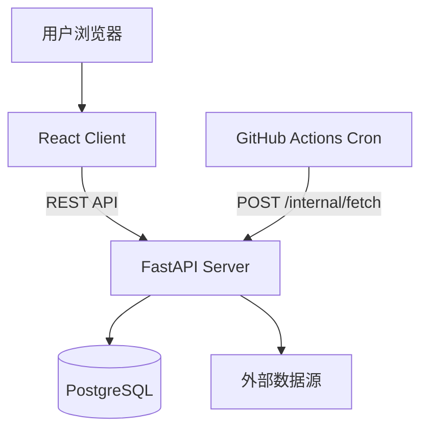

# 架构说明

## 整体架构

## 后端模块

| 模块 | 职责 |
|------|------|
| `app/api/routes.py` | 公开 REST API |
| `app/api/internal.py` | 内部 cron 触发端点 |
| `app/fetchers/` | 各数据源抓取器 |
| `app/services/fetcher_manager.py` | 抓取调度与 upsert |
| `app/services/price_service.py` | 查询业务逻辑 |
| `app/models/` | SQLAlchemy 数据模型 |

## 数据流

1. GitHub Actions 每日 02:00 UTC 调用 `POST /internal/fetch`
2. FetcherManager 依次运行 Gold / Oil / Basket / Commodity / Forex / Market 六个抓取器
3. 每个抓取器返回 `PriceRecordCreate` 列表
4. 按 `(item_id, record_date)` upsert 到 `price_records`
5. 前端通过 REST API 读取最新价与历史趋势

## 前端页面

| 路由 | 页面 | 功能 |
|------|------|------|
| `/` | 首页 | 分类概览、样本价格（含汇率/股指/科技） |
| `/catalog` | 价格目录 | 筛选、搜索、订阅 |
| `/items/:code` | 品种详情 | 趋势图、涨跌幅 |
| `/profile` | 个人中心 | localStorage 订阅列表 |

## 扩展点

- 用户认证：预留 `useSubscriptions` hook，可迁移至服务端
- 新数据源：实现 `BaseFetcher` 并注册到 `FetcherManager`（现有：Gold / Oil / Basket / Commodity / Forex / Market）
- 新品种：在 `seed_data.py` 添加后运行 `python -m app.seed` 初始化/同步
- Dashboard：`get_dashboard` 优先返回已有最新价的样本，避免空价项占满首页
